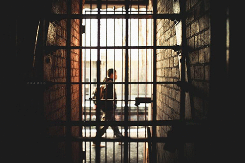
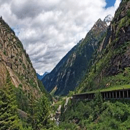
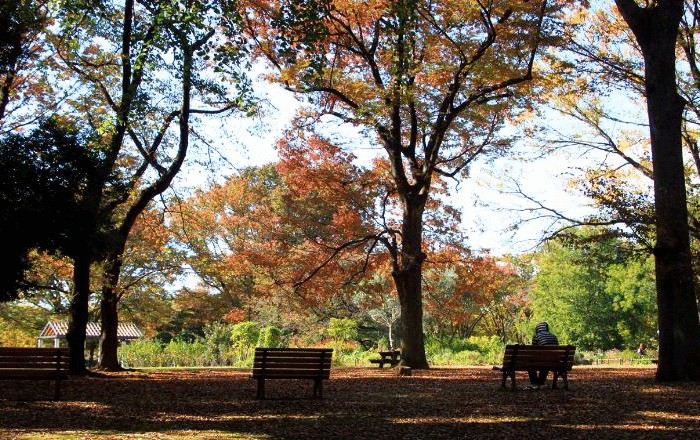

# PyTorch-SIGGRAPH2017-Inpainting
This is an implementation of [Globally and Locally Consistent Image Completion](http://hi.cs.waseda.ac.jp/~iizuka/projects/completion/) with **PyTorch**.    
日本語README（追加予定）

## Results
gif: input -> masked -> output -> blackout
- result1  
  
- result2  
  
- result3  
  

## Requirements
- Python 3  
- PyTorch  
- NumPy
- OpenCV  
- [pyamg](https://github.com/pyamg/pyamg) (optional, but required for post-processing)
- scipy (optional, but required for post-processing)  

This code can run without GPU.  


## Download pre-train model  
Download the trained model　to the current directory:
```
wget --continue -O completionnet_places2.t7 http://hi.cs.waseda.ac.jp/~iizuka/data/completionnet_places2.t7
```

## Usage  
Basic usage is:
```
python inpaint.py --input <input_image> --mask <mask_image>
```
The mask is a Black and White image. White is completed reagion.  And, the mask should be the same size as the input image.  If the mask is not specified, a mask with randomly generated holes will be used.  
Mask example:  
<p align="center">

</p>


Other options:
- ```--gpu``` : Use GPU for the computation, however may not become faster. Defaults to ```False```.
- ```--postproc``` : Able the post-processing(poisson blending). Dafaults to ```False```. This poisson blending script is forked from [this repository](https://github.com/parosky/poissonblending).  

**For example:**  
```
python inpaint.py --input example.png --mask example_mask.png
```
Finally, please push this repository **Star** bottom! Thank you.  

## Notes
- This is developed on a Linux machine running Ubuntu 16.04.
- According to the original paper, this pre-trained model was trained on Places2 dataset and thus performance is for natural outdoor images.
- This script referenced [here](https://github.com/satoshiiizuka/siggraph2017_inpainting) and [here](https://github.com/parosky/poissonblending).

## Licence
```
This work is licensed under the Creative Commons:
  http://creativecommons.org/licenses/by-nc-sa/4.0/
```

## Citation
Please cite the original paper in your publications:
```
@Article{IizukaSIGGRAPH2017,
  author = {Satoshi Iizuka and Edgar Simo-Serra and Hiroshi Ishikawa},
  title = {{Globally and Locally Consistent Image Completion}},
  journal = "ACM Transactions on Graphics (Proc. of SIGGRAPH)",
  year = 2017,
  volume = 36,
  number = 4,
  pages = 107:1--107:14,
  articleno = 107,
}
```
